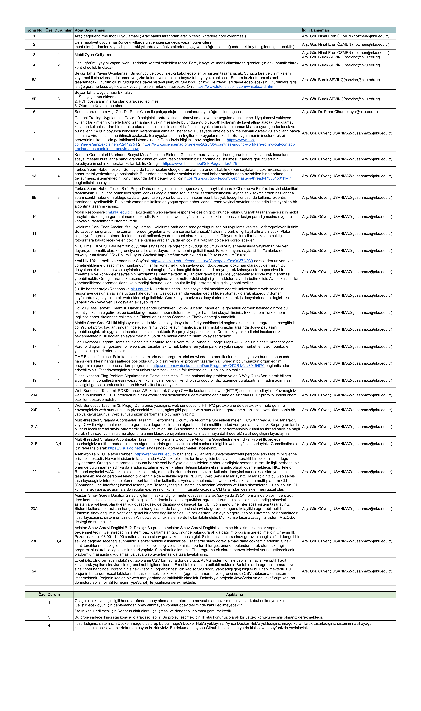

# Bahar 2020-2021 Proje:1

### Secilen Konu: (20A)

POSIX Threaded HTTP Sunucusu

>Vanilla C ile programlanmis olan bu http sunucusu pthreads(POSIX) araciligiyla
>asenkron bir yapida olup bircok cesit dosyayi istemciye transfer edebilme ozelligine sahiptir.
Bu transfer ozelligi sunucunun statik bir websitesi (html,css,js) veya da text(json,txt,vs.) servis programi
olarak kullanilma ozelligi katiyor.

P.S: Sadece GET ve OPTIONS requestleri desteklenmektedir.

## Ogrenci Bilgileri

- Isim: Eray
- Soyisim: Onur
- Ogrenci Numarasi: 2170656015
- Staj Gun Sayisi: 31

##Konular:

